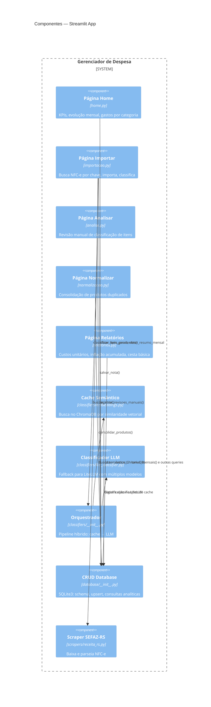
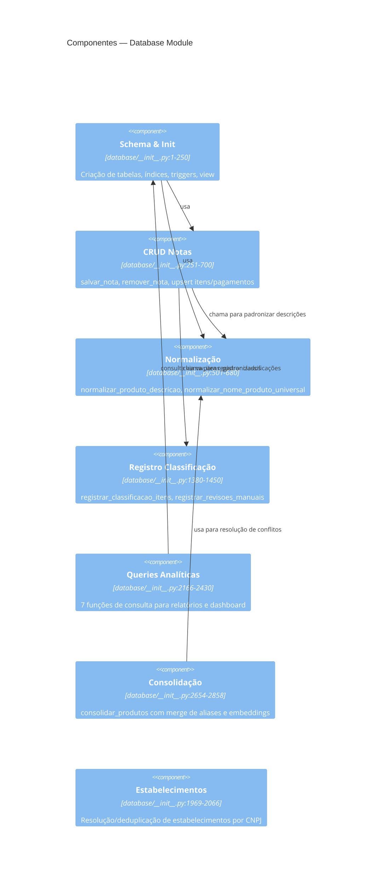
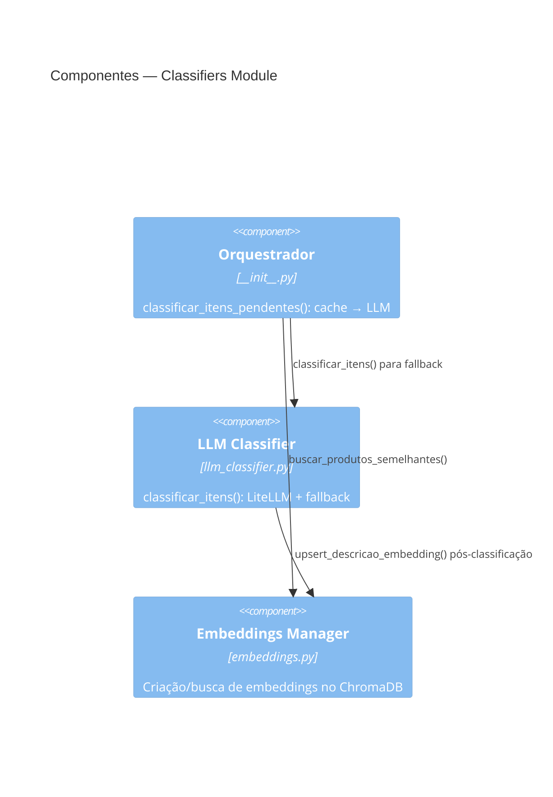
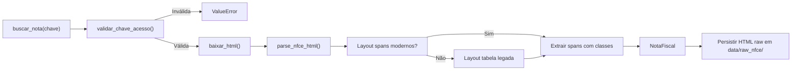
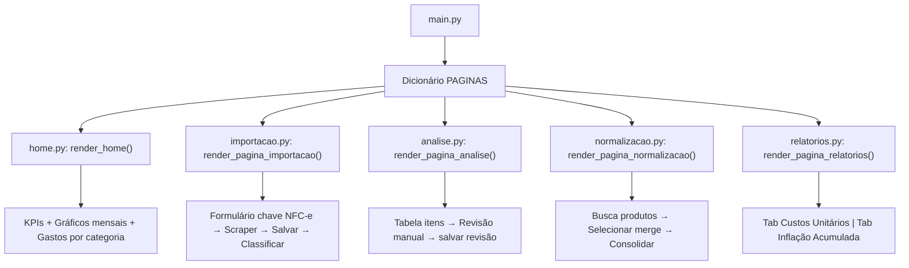

# C4 Components — Gerenciador de despesa

> Nível 3: Componentes internos dos containers mais relevantes

## Streamlit App — Componentes

## Database Module — Componentes

## Classifiers Module — Componentes

## Scrapers Module — Fluxo

## UI Module — Navegação

