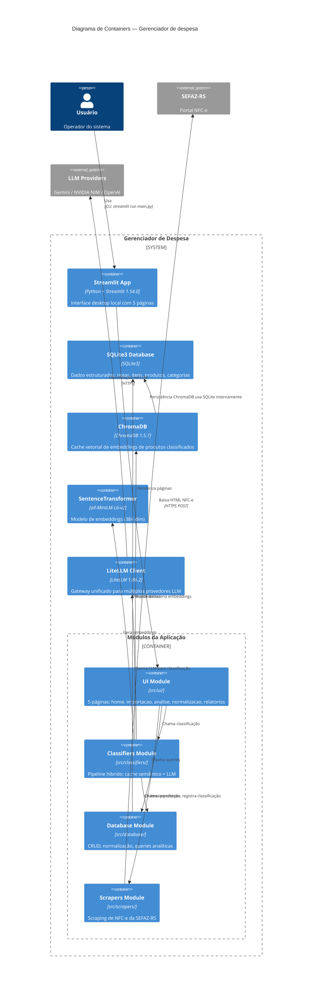

# C4 Containers — Gerenciador de despesa

> Nível 2: Diagrama de Containers

## Containers

| Container | Tecnologia | Função | Estado |
|-----------|-----------|--------|--------|
| **Streamlit App** | Python + Streamlit 1.54.0 | Interface do usuário — 5 páginas | 🟢 Ativo |
| **SQLite3 Database** | SQLite3 (stdlib) | Dados estruturados (gastos.db) | 🟢 Ativo |
| **ChromaDB** | ChromaDB 1.5.7 | Cache vetorial (data/chroma/) | 🟢 Ativo |
| **SentenceTransformer** | all-MiniLM-L6-v2 | Modelo de embeddings (384 dim) | 🟢 Ativo |
| **LiteLLM Client** | LiteLLM 1.86.2 | Gateway para LLMs | 🟢 Ativo |
