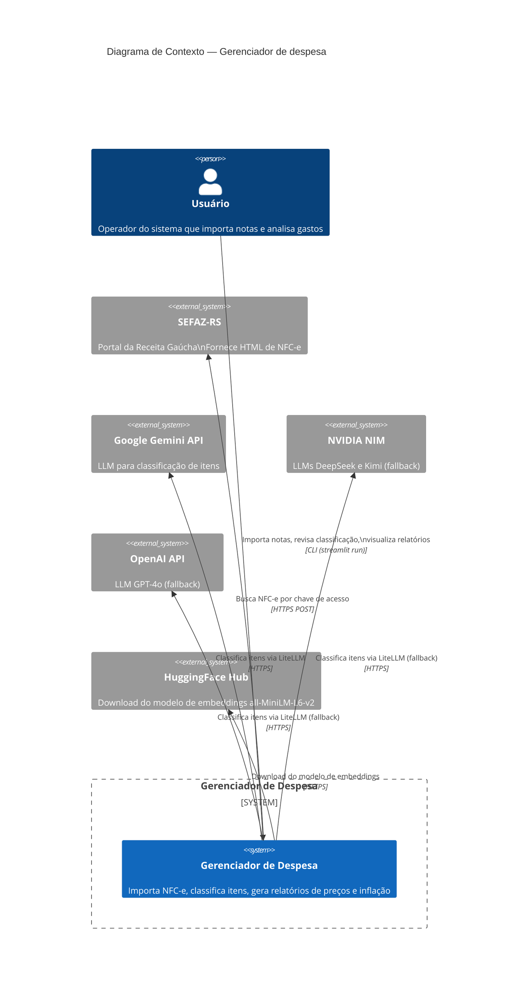

# C4 Context — Gerenciador de despesa

> Nível 1: Diagrama de Contexto

## Relacionamentos

| De | Para | O quê | Protocolo | Frequência |
|----|------|-------|-----------|------------|
| Usuário | Sistema | Importar nota, revisar classificação, ver relatórios | CLI local | Sob demanda |
| Sistema | SEFAZ-RS | Baixar HTML da NFC-e | HTTPS POST | Por importação |
| Sistema | Gemini API | Classificar itens não encontrados no cache | HTTPS (LiteLLM) | Por lote de itens |
| Sistema | NVIDIA NIM | Classificar (fallback se Gemini falhar) | HTTPS (LiteLLM) | Sob falha |
| Sistema | OpenAI API | Classificar (fallback final) | HTTPS (LiteLLM) | Sob falha |
| Sistema | HuggingFace | Baixar modelo all-MiniLM-L6-v2 | HTTPS | 1x (offline-first após cache) |
