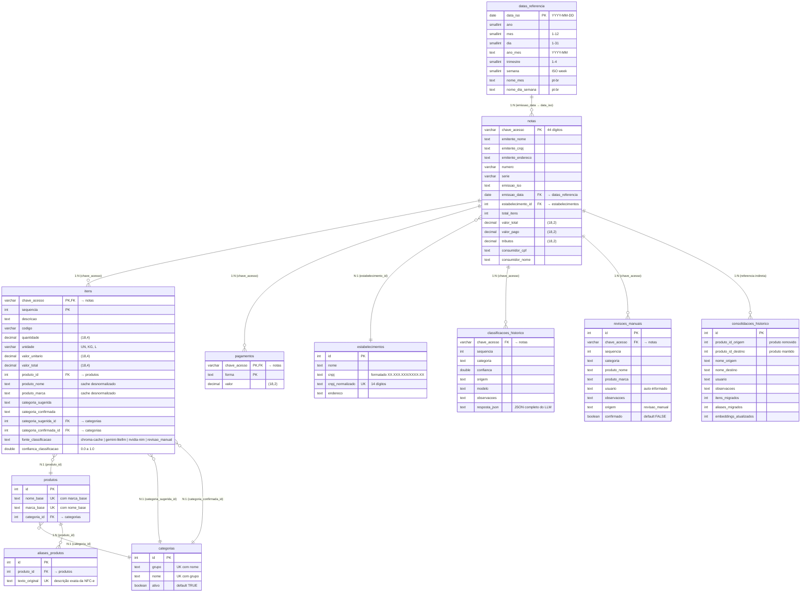

# ERD Completo — Gerenciador de despesa

> Gerado pelo Architect em 2026-06-06
> Banco: SQLite3 (data/gastos.db)

## Diagrama de Entidades e Relacionamentos



## Cardinalidades

| Tabela A | Relação | Tabela B | Descrição |
|----------|---------|----------|-----------|
| notas | 1 : N | itens | Uma nota tem vários itens |
| notas | 1 : N | pagamentos | Uma nota tem várias formas de pagamento |
| notas | N : 1 | estabelecimentos | Muitas notas pertencem a um estabelecimento |
| notas | N : 1 | datas_referencia | Muitas notas referenciam uma data |
| itens | N : 1 | produtos | Muitos itens referenciam um produto padronizado |
| itens | N : 1 | categorias | Muitos itens têm uma categoria sugerida |
| itens | N : 1 | categorias | Muitos itens têm uma categoria confirmada |
| produtos | N : 1 | categorias | Muitos produtos pertencem a uma categoria |
| produtos | 1 : N | aliases_produtos | Um produto tem vários aliases (descrições originais) |
| notas | 1 : N | classificacoes_historico | Uma nota tem várias classificações registradas |
| notas | 1 : N | revisoes_manuais | Uma nota pode ter várias revisões manuais |

## View

```sql
-- vw_itens_padronizados: junta itens + notas + datas_referencia + estabelecimentos
-- Colunas: chave_acesso, sequencia, data_emissao, ano, mes, dia, ano_mes,
--          trimestre, semana, nome_mes, nome_dia_semana,
--          estabelecimento_id, estabelecimento_nome, estabelecimento_cnpj,
--          estabelecimento_endereco, categoria_final (COALESCE),
--          categoria_final_id (COALESCE), quantidade, valor_unitario,
--          valor_total, produto_id, produto_nome, produto_marca
```

## Índices

| Tabela | Índice | Tipo | Colunas |
|--------|--------|------|---------|
| itens | idx_itens_produto_nome | B-tree | produto_nome |
| itens | idx_itens_chave_acesso | B-tree | chave_acesso |
| itens | idx_itens_categoria | B-tree | categoria_sugerida, categoria_confirmada |
| aliases_produtos | idx_aliases_texto_original | B-tree | texto_original |
| classificacoes_historico | idx_class_hist_chave | B-tree | chave_acesso |
