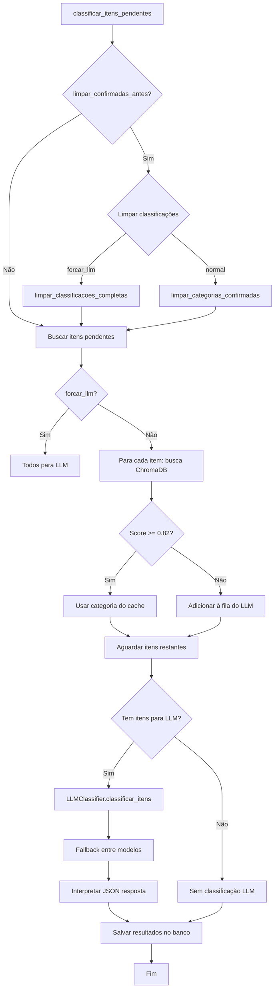
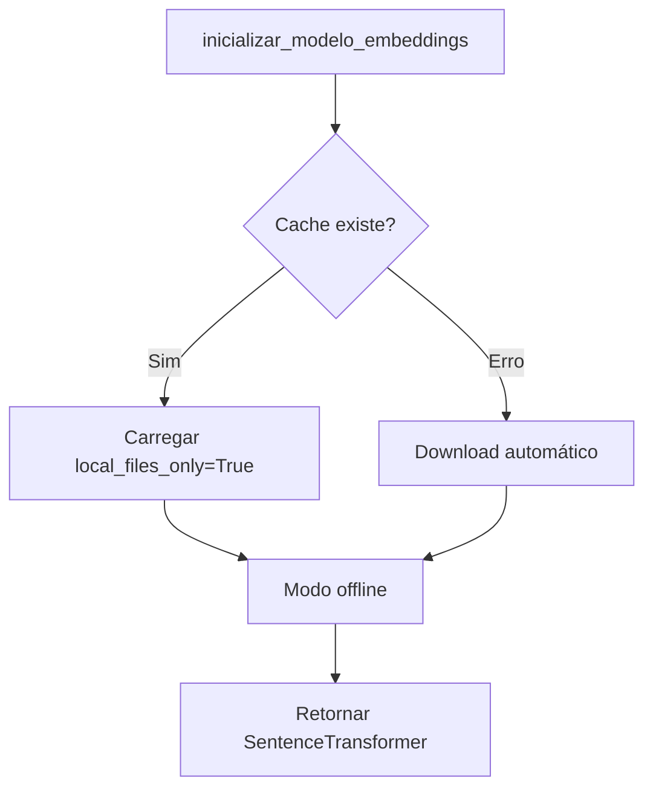
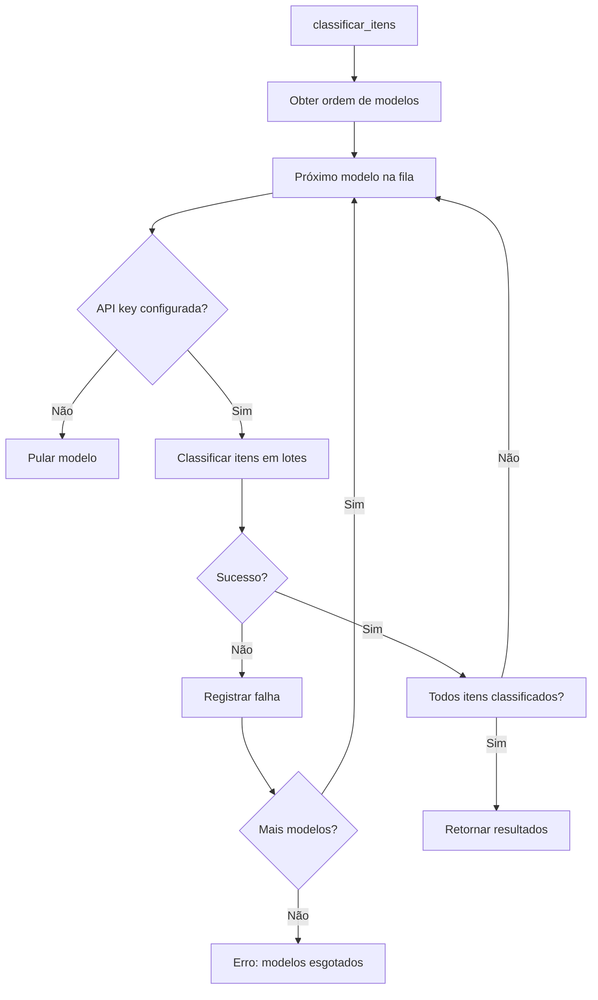

# Fluxograma — classifiers

> Gerado pelo Archaeologist

## Pipeline de Classificação Híbrida

```mermaid
flowchart TD
    A[classificar_itens_pendentes] --> B{limpar_confirmadas_antes?}
    B -->|Sim| C{Limpar classificações}
    C -->|forcar_llm| D[limpar_classificacoes_completas]
    C -->|normal| E[limpar_categorias_confirmadas]
    B -->|Não| F[Buscar itens pendentes]
    D --> F
    E --> F

    F --> G{forcar_llm?}
    G -->|Sim| H[Todos para LLM]
    G -->|Não| I[Para cada item: busca ChromaDB]

    I --> J{Score >= 0.82?}
    J -->|Sim| K[Usar categoria do cache]
    J -->|Não| L[Adicionar à fila do LLM]

    K --> M[Aguardar itens restantes]
    L --> M
    M --> N{Tem itens para LLM?}
    N -->|Sim| O[LLMClassifier.classificar_itens]
    O --> P[Fallback entre modelos]
    P --> Q[Interpretar JSON resposta]
    N -->|Não| R[Sem classificação LLM]

    Q --> S[Salvar resultados no banco]
    R --> S
    S --> T[Fim]
```

## Inicialização de Embeddings

```mermaid
flowchart TD
    A[inicializar_modelo_embeddings] --> B{Cache existe?}
    B -->|Sim| C[Carregar local_files_only=True]
    B -->|Erro| D[Download automático]
    C --> E[Modo offline]
    D --> E
    E --> F[Retornar SentenceTransformer]
```

## Fallback de Modelos LLM

```mermaid
flowchart TD
    A[classificar_itens] --> B[Obter ordem de modelos]
    B --> C[Próximo modelo na fila]
    C --> D{API key configurada?}
    D -->|Não| E[Pular modelo]
    D -->|Sim| F[Classificar itens em lotes]
    F --> G{Sucesso?}
    G -->|Não| H[Registrar falha]
    H --> I{Mais modelos?}
    I -->|Sim| C
    I -->|Não| J[Erro: modelos esgotados]
    G -->|Sim| K[Todos itens classificados?]
    K -->|Não| C
    K -->|Sim| L[Retornar resultados]
```
