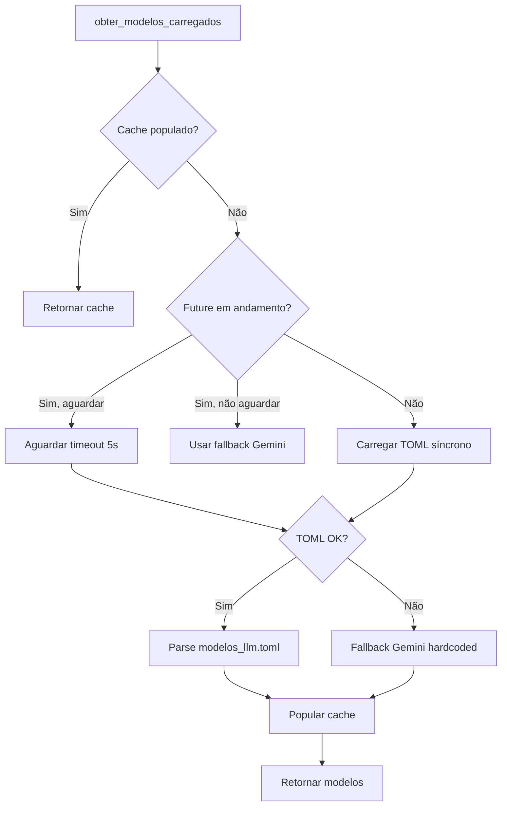

# Fluxograma — config

> Gerado pelo Archaeologist

## Carregamento de Modelos

```mermaid
flowchart TD
    A[obter_modelos_carregados] --> B{Cache populado?}
    B -->|Sim| C[Retornar cache]
    B -->|Não| D{Future em andamento?}
    D -->|Sim, aguardar| E[Aguardar timeout 5s]
    D -->|Sim, não aguardar| F[Usar fallback Gemini]
    D -->|Não| G[Carregar TOML síncrono]
    E --> H{TOML OK?}
    G --> H
    H -->|Sim| I[Parse modelos_llm.toml]
    H -->|Não| J[Fallback Gemini hardcoded]
    I --> K[Popular cache]
    J --> K
    K --> L[Retornar modelos]
```
