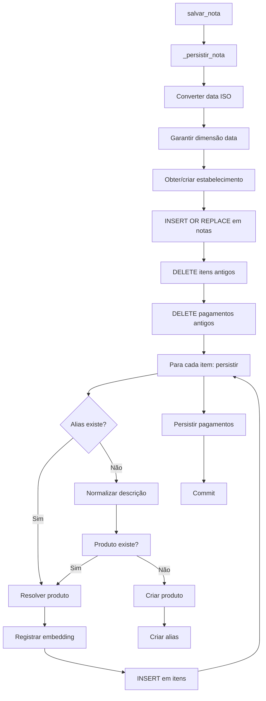
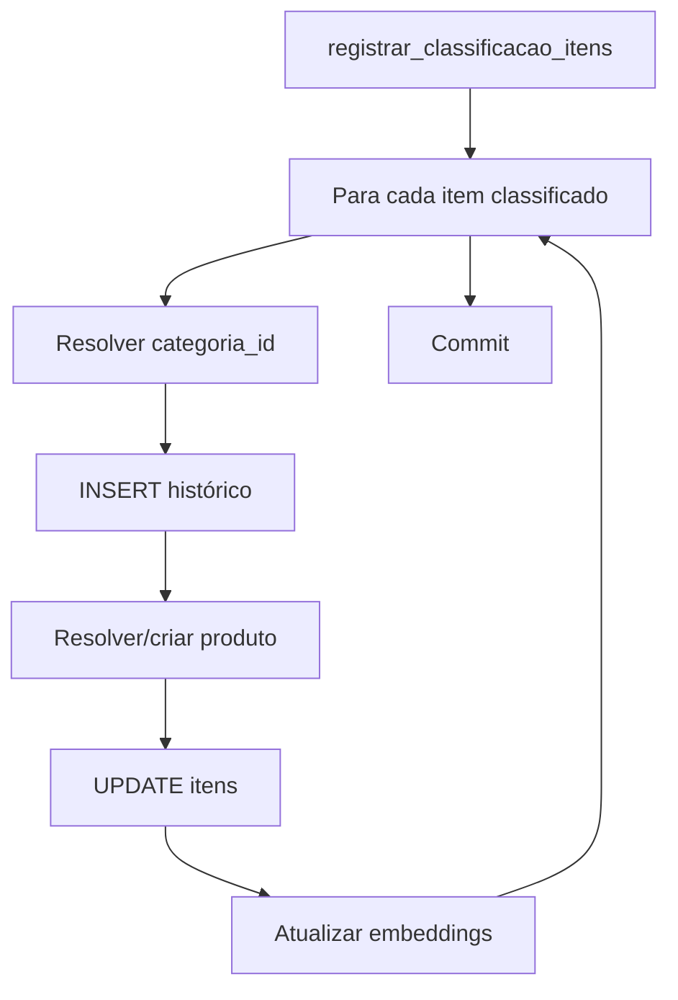
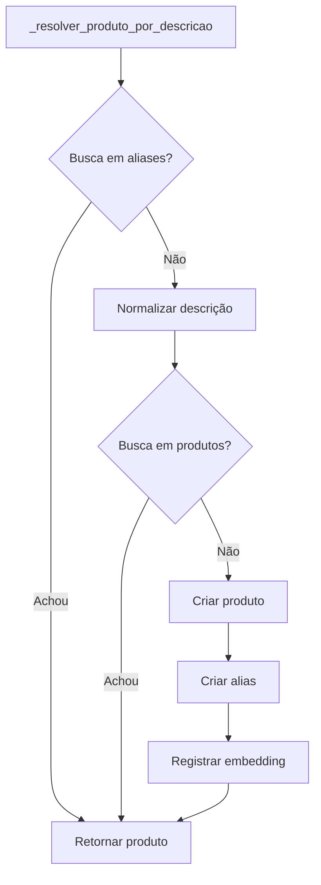

# Fluxograma — database

> Gerado pelo Archaeologist

## Salvar Nota Fiscal

```mermaid
flowchart TD
    A[salvar_nota] --> B[_persistir_nota]
    B --> C[Converter data ISO]
    C --> D[Garantir dimensão data]
    D --> E[Obter/criar estabelecimento]
    E --> F[INSERT OR REPLACE em notas]
    F --> G[DELETE itens antigos]
    G --> H[DELETE pagamentos antigos]
    H --> I[Para cada item: persistir]
    I --> J{Alias existe?}
    J -->|Sim| K[Resolver produto]
    J -->|Não| L[Normalizar descrição]
    L --> M[Produto existe?]
    M -->|Sim| K
    M -->|Não| N[Criar produto]
    N --> O[Criar alias]
    K --> P[Registrar embedding]
    P --> Q[INSERT em itens]
    Q --> I
    I --> R[Persistir pagamentos]
    R --> S[Commit]
```

## Registro de Classificação

```mermaid
flowchart TD
    A[registrar_classificacao_itens] --> B[Para cada item classificado]
    B --> C[Resolver categoria_id]
    C --> D[INSERT histórico]
    D --> E[Resolver/criar produto]
    E --> F[UPDATE itens]
    F --> G[Atualizar embeddings]
    G --> B
    B --> H[Commit]
```

## Resolução de Produto

```mermaid
flowchart TD
    A[_resolver_produto_por_descricao] --> B{Busca em aliases?}
    B -->|Achou| C[Retornar produto]
    B -->|Não| D[Normalizar descrição]
    D --> E{Busca em produtos?}
    E -->|Achou| C
    E -->|Não| F[Criar produto]
    F --> G[Criar alias]
    G --> H[Registrar embedding]
    H --> C
```
