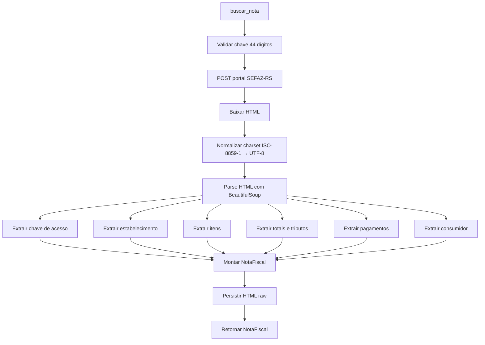
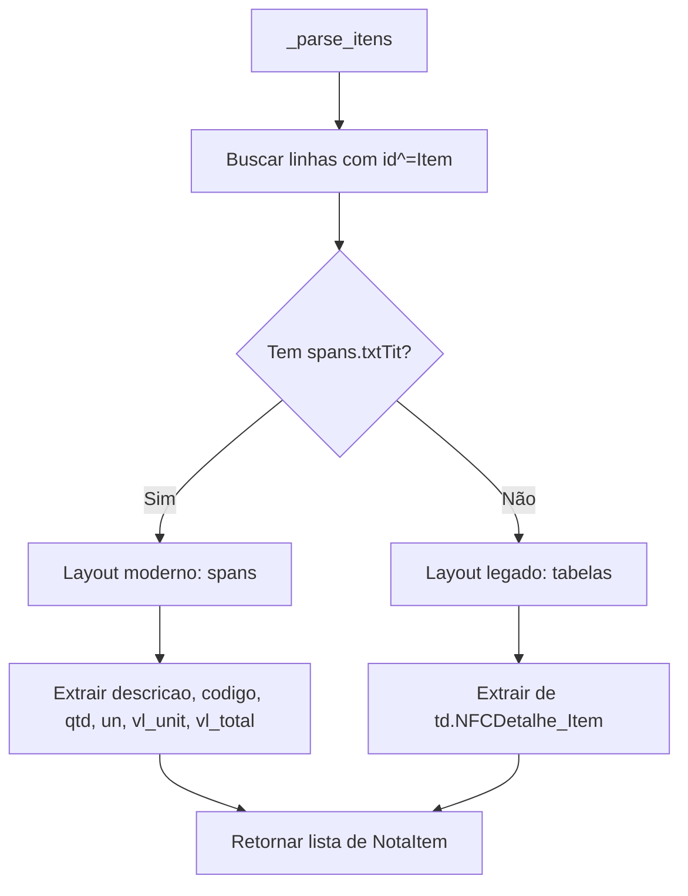

# Fluxograma — scrapers

> Gerado pelo Archaeologist

## Importação de NFC-e

```mermaid
flowchart TD
    A[buscar_nota] --> B[Validar chave 44 dígitos]
    B --> C[POST portal SEFAZ-RS]
    C --> D[Baixar HTML]
    D --> E[Normalizar charset ISO-8859-1 → UTF-8]
    E --> F[Parse HTML com BeautifulSoup]
    F --> G[Extrair chave de acesso]
    F --> H[Extrair estabelecimento]
    F --> I[Extrair itens]
    F --> J[Extrair totais e tributos]
    F --> K[Extrair pagamentos]
    F --> L[Extrair consumidor]
    G --> M[Montar NotaFiscal]
    H --> M
    I --> M
    J --> M
    K --> M
    L --> M
    M --> N[Persistir HTML raw]
    N --> O[Retornar NotaFiscal]
```

## Parsing de Itens (2 layouts)

```mermaid
flowchart TD
    A[_parse_itens] --> B[Buscar linhas com id^=Item]
    B --> C{Tem spans.txtTit?}
    C -->|Sim| D[Layout moderno: spans]
    C -->|Não| E[Layout legado: tabelas]
    D --> F[Extrair descricao, codigo, qtd, un, vl_unit, vl_total]
    E --> G[Extrair de td.NFCDetalhe_Item]
    F --> H[Retornar lista de NotaItem]
    G --> H
```
