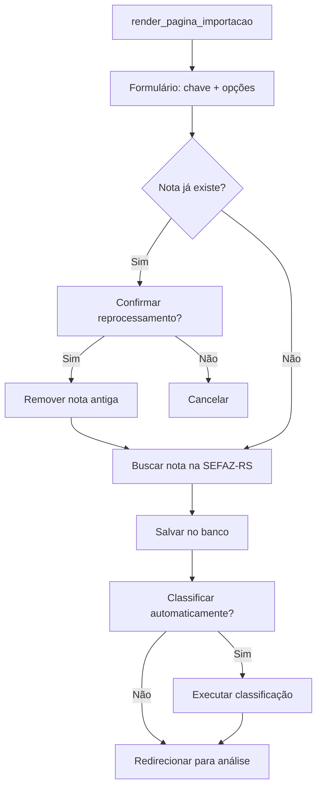
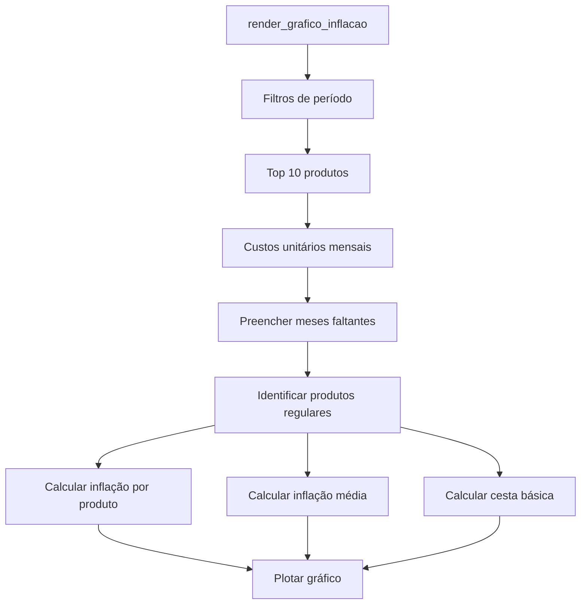

# Fluxograma — ui

> Gerado pelo Archaeologist

## Fluxo de Importação



## Fluxo de Análise e Revisão

```mermaid
flowchart TD
    A[render_pagina_analise] --> B[Listar notas para revisão]
    B --> C[Selecionar nota]
    C --> D[Exibir itens em data_editor]
    D --> E{Ação do usuário}
    E -->|Reprocessar via IA| F[Diálogo escolher modelo]
    F --> G[classificar_itens_pendentes]
    E -->|Salvar rascunho| H[registrar_revisoes_manuais(confirmar=False)]
    E -->|Confirmar ajustes| I[registrar_revisoes_manuais(confirmar=True)]
    H --> J[Atualizar UI]
    I --> J
```

## Fluxo de Relatórios — Inflação Acumulada


