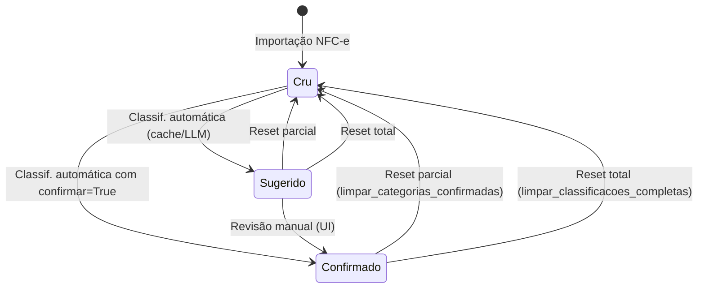
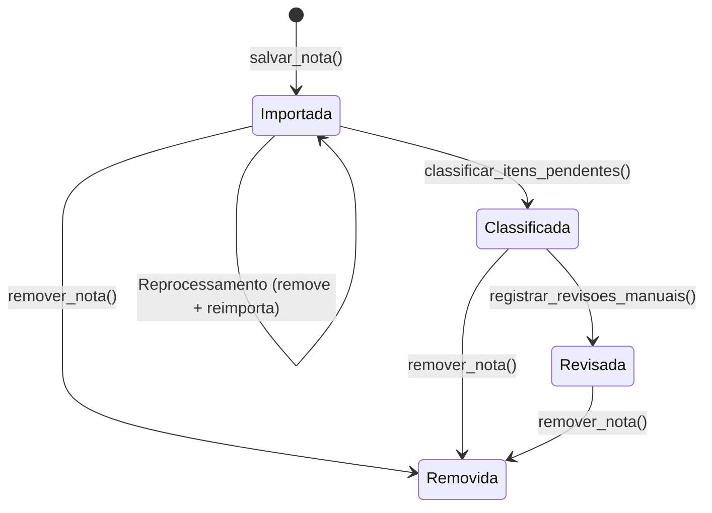
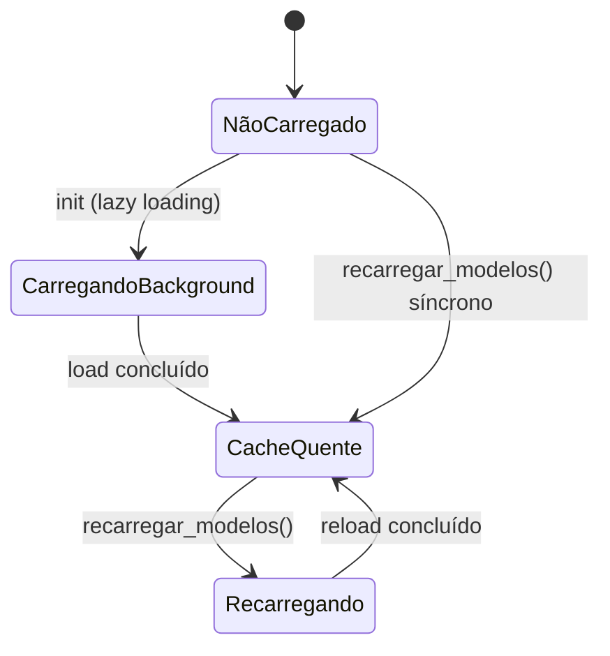

# Máquinas de Estado — Gerenciador de despesa

> Gerado pelo Detective em 2026-06-06

---

## 1. Estado do Item (tabela `itens`)

### Campos de estado
- `categoria_sugerida` (TEXT, nullable)
- `categoria_confirmada` (TEXT, nullable)

### Diagrama

### Estados

| Estado | categoria_sugerida | categoria_confirmada | Descrição |
|--------|-------------------|---------------------|-----------|
| **Cru** | NULL | NULL | Item recém-importado, não processado |
| **Sugerido** | "Alimentação" | NULL | Classificado automaticamente, aguarda revisão |
| **Confirmado** | "Alimentação" | "Alimentação" | Revisado e confirmado |
| **Revisado-diferente** | "Alimentação" | "Transporte" | Confirmado com categoria diferente |

### Transições

| De | Para | Gatilho | Função | Local |
|----|------|---------|--------|-------|
| Cru | Sugerido | Classificação automática | `classificar_itens_pendentes()` | `classifiers/__init__.py:30` |
| Cru | Confirmado | Classificação automática (confirmar) | `classificar_itens_pendentes(confirmar=True)` | `classifiers/__init__.py:30` |
| Sugerido | Confirmado | Revisão manual | `registrar_revisoes_manuais(confirmar=True)` | `database/__init__.py:1385` |
| Confirmado | Cru | Reset parcial | `limpar_categorias_confirmadas()` | `database/__init__.py:682` |
| Qualquer | Cru | Reset total | `limpar_classificacoes_completas()` | `database/__init__.py:653` |

---

## 2. Estado da Nota Fiscal (implícito)

### Diagrama

### Estados

| Estado | Critério | Descrição |
|--------|----------|-----------|
| **Importada** | Nota no banco, itens em Cru | Após `salvar_nota()` |
| **Classificada** | Ao menos 1 item em Sugerido/Confirmado | Após classificação automática |
| **Revisada** | Todos itens com categoria_confirmada preenchida | Após revisão manual completa |
| **Removida** | Nota deletada + cascata | Após `remover_nota()` |

Não há campo `status` explícito na tabela `notas` — o estado é inferido dos itens vinculados.

---

## 3. Estado do Produto (tabela `produtos`)

| Estado | categoria_id | Descrição |
|--------|-------------|-----------|
| **Não categorizado** | NULL | Criado automaticamente ao importar |
| **Categorizado** | 5 (ex.) | Categoria atribuída na classificação |
| **Consolidado (origem)** | — | Deletado após merge em outro produto |

### Transições

1. **Não categorizado → Categorizado**: durante classificação, `_resolver_produto_por_nome_marca()` atualiza `categoria_id`
2. **→ Excluído**: `consolidar_produtos()` deleta o produto origem permanentemente

---

## 4. Estado do Carregamento de Modelos LLM

### Diagrama

| Estado | _modelos_cache | _carregamento_em_andamento |
|--------|---------------|--------------------------|
| **Não carregado** | None | None |
| **Carregando background** | None | Future (Executor) |
| **Cache quente** | list[ModeloConfig] | None |
| **Recarregando** | Invalidade | Novo Future |

---

## 5. Estado do Cache de Embeddings

| Estado | Descrição |
|--------|-----------|
| **Não inicializado** | Modelo não carregado, ChromaDB não conectado |
| **Cache local disponível** | Modelo carregado do cache HuggingFace local |
| **Download necessário** | Modelo baixado do HuggingFace Hub |
| **Erro** | Falha ao carregar (tratada com exceção específica) |
